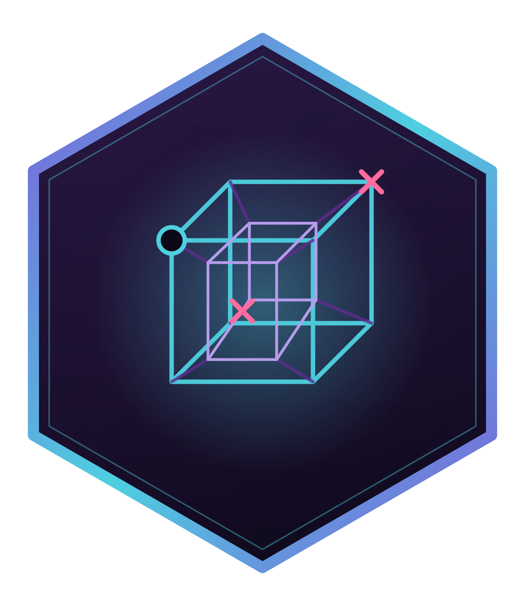
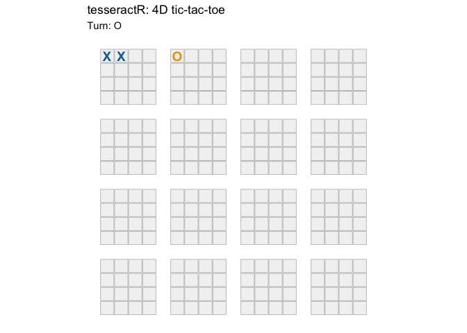

# tesseractR 

<!-- badges: start -->

[](https://github.com/r-heller/tesseractR/actions/workflows/R-CMD-check.yaml)
[](https://r-heller.github.io/tesseractR/)
[](https://CRAN.R-project.org/package=tesseractR)
[](https://app.codecov.io/gh/r-heller/tesseractR?branch=main)
[](https://cran.r-project.org/package=tesseractR)
[](https://cran.r-project.org/package=tesseractR)
[](https://opensource.org/licenses/MIT)
[](https://lifecycle.r-lib.org/articles/stages.html#experimental)
<!-- badges: end -->

`tesseractR` plays four-dimensional tic-tac-toe on a `4×4×4×4` hypercube
(256 cells, 520 winning lines), with a depth-limited negamax AI, a
ggplot2 visualization of the hypercube as a 4×4 grid of 4×4 boards, and
an interactive Shiny app with live move evaluation and a game-analysis
panel.

## Installation

``` r
# install.packages("remotes")
remotes::install_github("r-heller/tesseractR")
```

## Example

``` r
library(tesseractR)
b <- tsr_new_board()
b <- tsr_move(b, 0L, 0L, 0L, 0L)   # X at (0,0,0,0)
b <- tsr_move(b, cell = 17L)       # O
b <- tsr_move(b, 1L, 0L, 0L, 0L)   # X
print(b)
#> 
#> ── <ttt_board> ──
#> 
#> 4x4x4x4 board, 256 cells
#> moves played: 3
#> to move: O
#> legal moves: 253
```

``` r
tsr_plot(b)
```



Launch the interactive app with `tsr_run_app()` (requires `shiny`).
