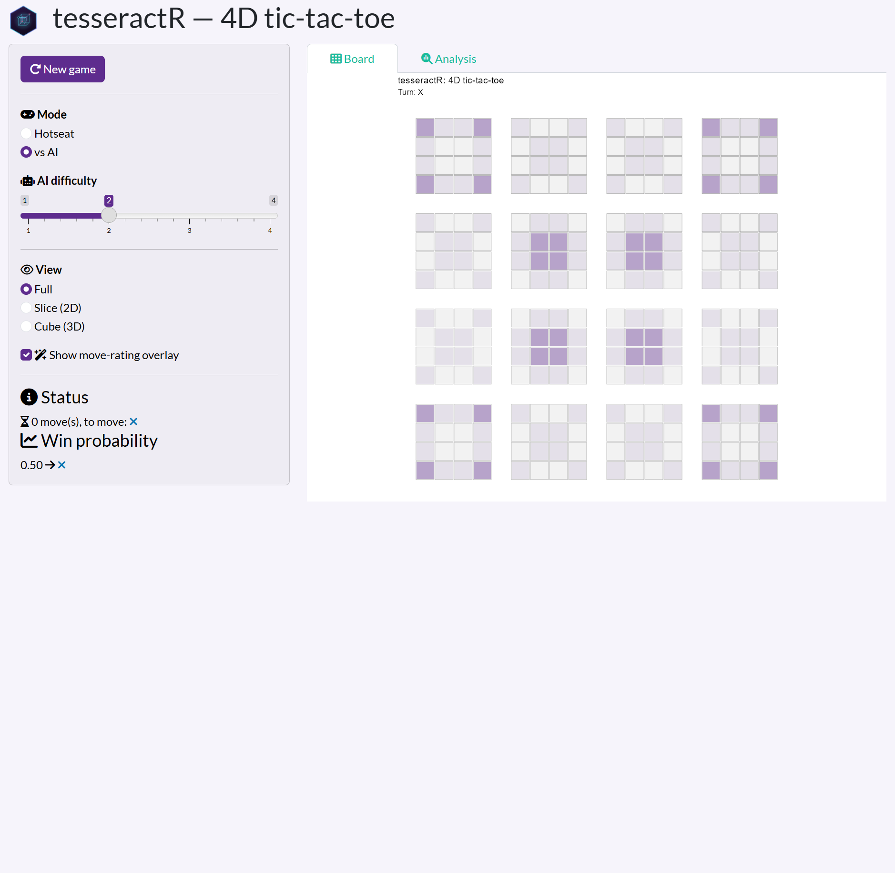
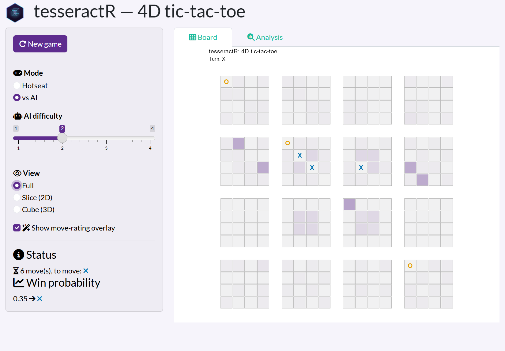
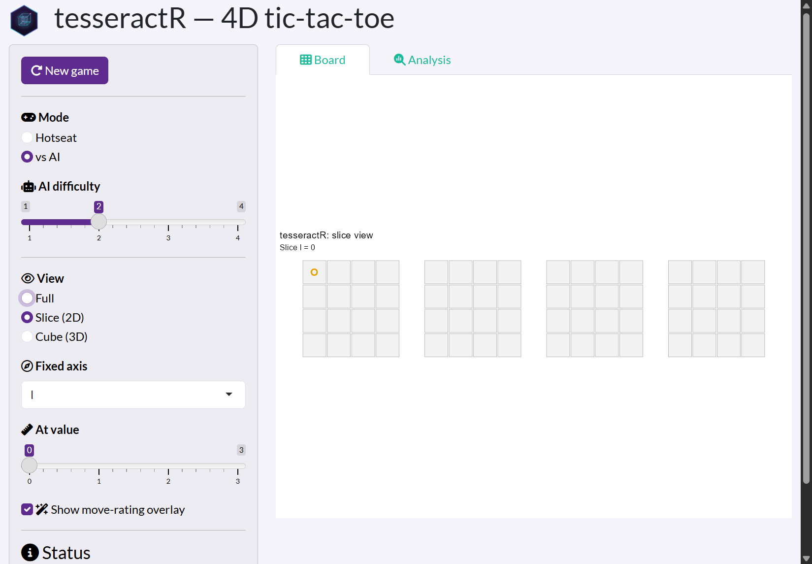
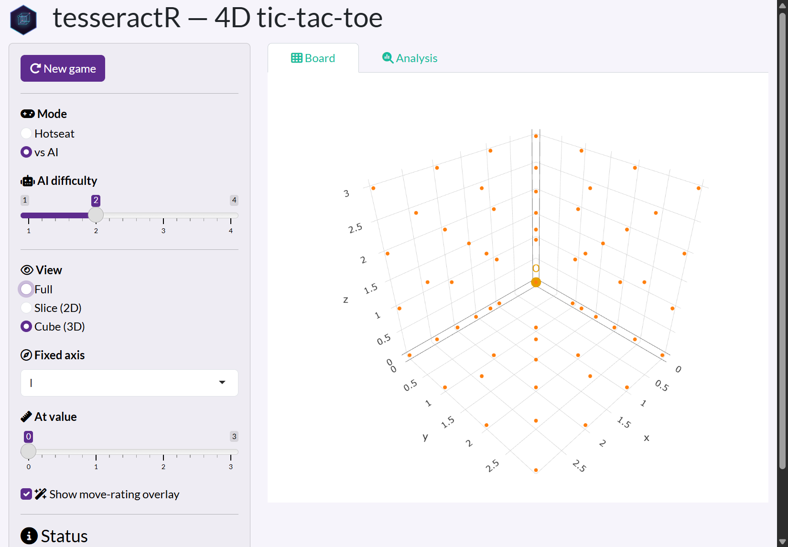
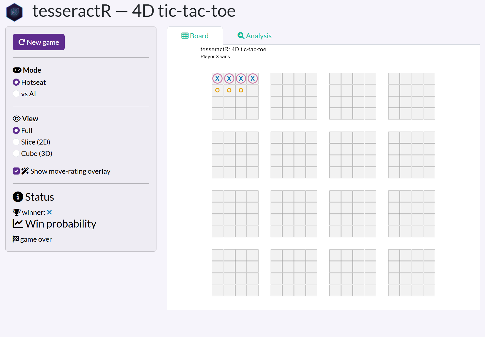
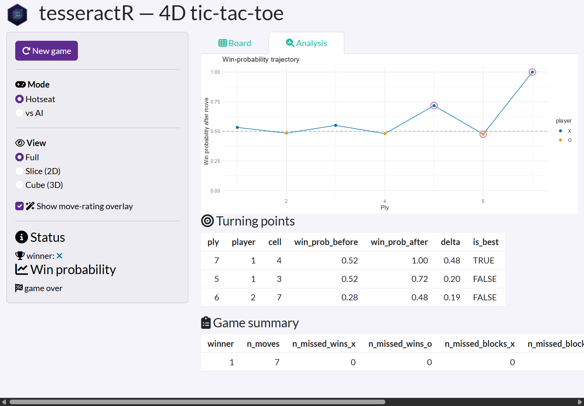

```{r, include = FALSE}
knitr::opts_chunk$set(collapse = TRUE, comment = "#>")
```

> **Tutorial page 2 of 4.**
> Previous: [« The rules](play-01-rules.html) ·
> Next: [Seeing in four dimensions »](play-03-strategy.html)

The fastest way to *feel* four-dimensional tic-tac-toe is to play it. The package
ships an interactive [Shiny](https://shiny.posit.co/) app. Install the package,
then launch it with one call:

```{r launch, eval = FALSE}
library(tesseractR)
tsr_run_app()              # opens in your browser
tsr_run_app(difficulty = 3) # start against a stronger AI
```

The screenshots below were captured from that app.

## The layout at a glance

```{r overview, echo = FALSE, out.width = "100%", fig.alt = "The tesseractR app: a control sidebar on the left and the board on the right."}

```

The window has two halves:

* **Left — the control sidebar.** New game, the playing **Mode**, the **AI
  difficulty**, the board **View**, the move-rating overlay toggle, and a live
  **Status** / **Win probability** read-out.
* **Right — the board**, with two tabs: **Board** (where you play) and
  **Analysis** (a post-game breakdown).

On an empty board the faint purple shading is the **move-rating overlay** —
darker cells are stronger opening moves. More on that below.

## Choosing how to play

* **Mode** — *Hotseat* (two humans taking turns on one screen) or *vs AI*.
* **AI difficulty** — a slider from 1 to 4. It sets how deep the negamax opponent
  searches: 1 is a quick, shallow opponent; 4 looks several moves ahead and is
  noticeably tougher.

**Making a move is just a click** on any empty cell in the *Full* view. In *vs
AI* mode the computer replies immediately, so the move count jumps by two each
time you play.

## Three ways to see the board

The **View** control switches between three representations of the same
position. Pick whichever makes the lines you care about easiest to see.

### Full

The default: all 256 cells at once, as a 4×4 grid of little boards. Here is a
game a few moves in, with X (blue) and O (orange) both on the board:

```{r full, echo = FALSE, out.width = "100%", fig.alt = "The full board view mid-game with X and O marks and the rating overlay."}

```

Notice the Status line — *6 moves, to move: X* — and the win probability, *0.35*,
both updating as you play.

### Slice (2D)

*Slice* fixes one axis (the **Fixed axis** and **At value** controls appear) and
shows the remaining 3D cube as a strip of four boards. This is the view that
turns cross-dimensional lines into straight ones:

```{r slice, echo = FALSE, out.width = "100%", fig.alt = "The slice view: a single 3D slice shown as four boards in a row."}

```

### Cube (3D)

If the `plotly` package is installed, *Cube (3D)* renders one slice as a rotatable
4×4×4 point cloud. Drag to spin it and inspect a line from any angle:

```{r cube, echo = FALSE, out.width = "100%", fig.alt = "The 3D cube view: a rotatable 4x4x4 grid of points."}

```

## The move-rating overlay

With **Show move-rating overlay** ticked, every empty cell is shaded by how good
a move it would be for the player to move — darker is better. It is the same
information `tsr_rate_moves()` returns from the console (see
[Playing from the R console](play-04-api.html)), drawn straight onto the board.
Use it as a hint when you are learning, or switch it off for a pure game.

The **Win probability** read-out in the sidebar is the matching single number:
the model's estimate that the side to move will win.

## Winning

When someone completes a line, the game ends, the four winning cells are ringed
in pink, and the Status switches to a trophy with the winner:

```{r win, echo = FALSE, out.width = "100%", fig.alt = "A won game: four X marks ringed in pink, status shows X as the winner."}

```

Press **New game** to start over (keeping your current mode and difficulty).

## The Analysis tab

After a game with a few moves, open the **Analysis** tab for a post-mortem:

```{r analysis, echo = FALSE, out.width = "100%", fig.alt = "The analysis tab: a win-probability trajectory, a turning-points table, and a game summary."}

```

* **Win-probability trajectory** — how the position swung move by move. Each
  point is coloured by who moved; circled points are the biggest swings.
* **Turning points** — the plies where the win probability moved the most, with
  the before/after values and whether the move was the best available.
* **Game summary** — totals: missed wins, missed blocks, and overall
  decisiveness.

The same numbers are available programmatically with `tsr_analyze_game()`,
`tsr_turning_points()`, and `tsr_game_summary()` — see the
[Simulation and Game Analysis](analysis.html) article.

> Next: [Seeing in four dimensions »](play-03-strategy.html)
